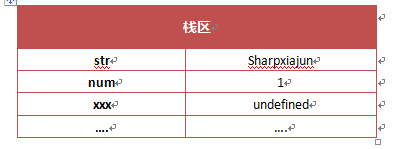
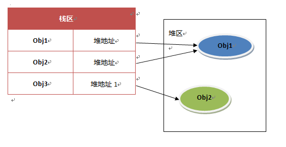

<h1>堆栈</h1>
1.基本类型
<pre>
Undefined
Null
Boolean
Number
String
</pre>
2.引用类型
<pre>引用类型是指多个指构成的对象，所以javascript的对象指的是引用类型</pre>
3. Javascript里的基本变量是存放在栈区的（栈区指内存里的栈内存），它的存储结构如下图所示：
 

javascript里引用变量的存储就比基本类型存储要复杂多，引用类型的存储需要内存的栈区和堆区（堆区是指内存里的堆内存）共同完成，如下图所示：
<pre>
在javascript里变量的存储包含三个部分：
部分一：栈区的变量标示符；
部分二：栈区变量的值；
部分三：堆区存储的对象。
</pre>

