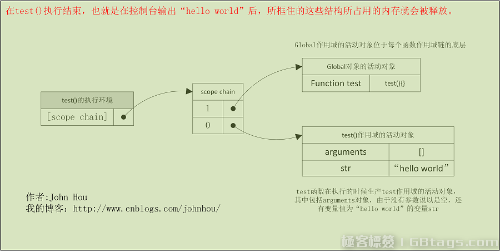

<h1>闭包</h1>

<b>闭包</b>：是指有权访问另外一个函数作用域中的变量的函。.创建闭包的常见方式就是在一个函数内部创建另外一个函数。

在javascript中没有块级作用域，一般为了给某个函数申明一些只有该函数才能使用的局部变量时，我们就会用到闭包，这样我们可以很大程度上减少全局作用域中的变量，净化全局作用域。

使用闭包有如上的好处，当然这样的好处是需要付出代价的，代价就是内存的占用

如何理解上面的那句话呢？

每个函数的执行，都会创建一个与该函数相关的函数执行环境，或者说是函数执行上下文。这个执行上下文中有一个属性 scope chain（作用域链指针），这个指针指向一个作用域链结构，作用域链中的指针又都指向各个作用域对应的活动对象。正常情况，一个函数在调用开始执行时创建这个函数执行上下文及相应的作用域链，在函数执行结束后释放函数执行上下文及相应作用域链所占的空间。

<h3>例如</h3>
<pre>
//声明函数
function test() {
  var str = "hello world";
  console.log(str);
}

//调用函数
test();
</pre>

在调用函数的时候会在内存中生成如下图的结构：

