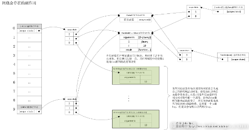

<h1>闭包</h1>

<b>闭包</b>：是指有权访问另外一个函数作用域中的变量的函。.创建闭包的常见方式就是在一个函数内部创建另外一个函数。

在javascript中没有块级作用域，一般为了给某个函数申明一些只有该函数才能使用的局部变量时，我们就会用到闭包，这样我们可以很大程度上减少全局作用域中的变量，净化全局作用域。

使用闭包有如上的好处，当然这样的好处是需要付出代价的，代价就是内存的占用

如何理解上面的那句话呢？

每个函数的执行，都会创建一个与该函数相关的函数执行环境，或者说是函数执行上下文。这个执行上下文中有一个属性 scope chain（作用域链指针），这个指针指向一个作用域链结构，作用域链中的指针又都指向各个作用域对应的活动对象。正常情况，一个函数在调用开始执行时创建这个函数执行上下文及相应的作用域链，在函数执行结束后释放函数执行上下文及相应作用域链所占的空间。

<h3>例如</h3>
<pre>
//声明函数
function test() {
  var str = "hello world";
  console.log(str);
}

//调用函数
test();
</pre>

在调用函数的时候会在内存中生成如下图的结构：

但是闭包的情况就有点特殊了，由于闭包函数可以访问外层函数中的变量，所以外层函数在执行结束后，其作用域活动对象并不会被释放（注意，外层函数执行结束后执行环境和对应的作用域链就会被销毁），而是被闭包函数的作用域链所引用，直到闭包函数被销毁后，外层函数的作用域活动对象才会被销毁。这也正是闭包要占用内存的原因。

所以使用闭包有好处，也有坏处，滥用闭包会造成内存的大量消耗。

使用闭包还有其他的副作用，可以说是bug，也可以说不是，相对不同的业务可能就会有不同的看法。

<h3>这个副作用是闭包函数只能取到外层函数变量的最终值。</h3>

测试代码如下:(这里使用了jquery对象)

<pre>
/*闭包缺陷*/
(function($) {
  var result = new Array(),
    i = 0;
  for (; i < 10; i++) {
    result[i] = function() {
      return i;
    };
  }
  $.RES1 = result;
})(jQuery);

$.RES1[0]();
</pre>

上面的代码先通过匿名函数表达式开辟了一块私有作用域，这个匿名函数就是我们上面所说的外层函数，该外层函数有一个参数$,同时还定义了变量result和 I , 通过for循环给数组result赋值一个匿名函数，这个匿名函数就是闭包，他访问了外层函数的变量I , 理论上数组result[i]() 会返回相应的数组下标值，实际情况却不如所愿。

<pre>如上代码 $.RES1[0]() 的执行结果是10. </pre>

为什么会这样呢，因为i的最终值就是10.

下面我们通过下图来详细说明下，上面的那段代码执行时在内存中到底发生了什么：

那么这个副作用有没有办法可以修复呢？当然可以！

我们可以通过下面的代码来达到我们的预期。

<pre>
/*修复闭包缺陷*/
(function($) {
  var result = new Array(),
    i = 0;
  for (; i < 10; i++) {
    result[i] = function(num) {
      return function() {
        return num;
      }
    }(i);
  }
  $.RES2 = result;
})(jQuery);

console.log($.RES2[0]());
</pre>

上面的代码又在内存中发生了什么？我们同样用下面的一幅图来详细解释。看懂了上面的图，我们也就不难理解下面的图。

<h3>闭包的最大用途</h3>
<pre>
1.可以读取函数内部的变量。
2.让函数内部变量的值始终保持在内存中。
</pre>
<pre>
<ul>
<li>闭包就是函数的局部变量集合，只是这些局部变量在函数返回后会继续存在。</li>
<li>闭包就是就是函数的“堆栈”在函数返回后并不释放，我们也可以理解为这些函数堆栈并不在栈上分配而是在堆上分配</li>
<li>当在一个函数内定义另外一个函数就会产生闭包</li>
</ul>
</pre>

